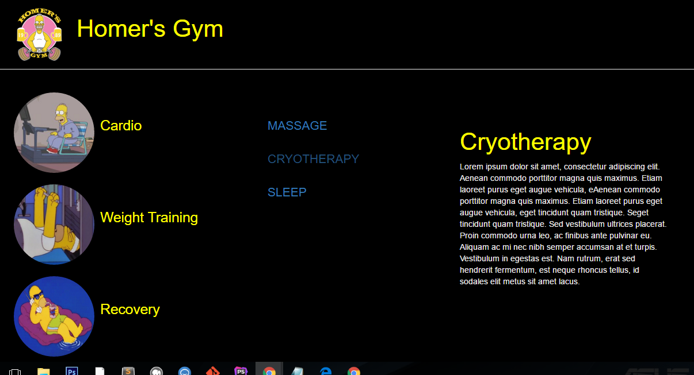

#AJAX & JSON (loading local files)

**About The Project**

This project was to solidify my knowledge of jQuery, AJAX and JSON for loading local content and updating page content dynamically.

**Features Implemented**

* jQery (events, selectors, delegation)
* AJAX & JSON ($.AJAX, $.getJSON)
* HTML, CSS (Bootstrap)
* JavaScript

